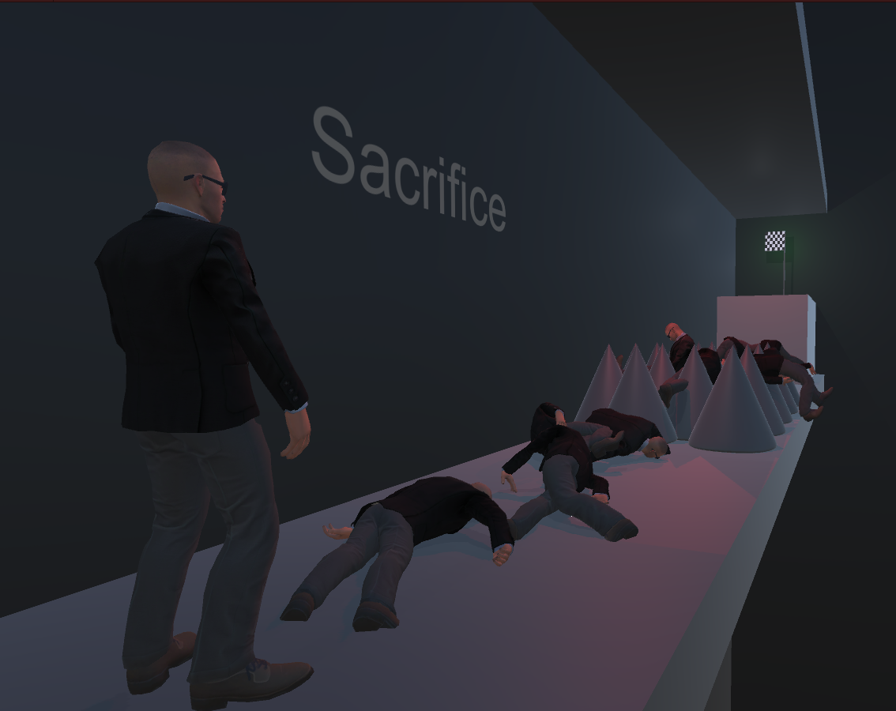

  

## Play

Game page on itch.io: https://guibdbello.itch.io/sacrifice

  

### How to Play

#### Controls

- **WASD**: Move.
- **Space**: Jump.
- **Left Mouse Button**: Throw grenade.

## About

Sometimes you must fail before you succeed.

### Game Jam

This game was made for the game jam [**Wowie Jam 3.0**](https://itch.io/jam/unexpectedjam) which took place between February 26th and March 1st of 2021.

Theme: **FAILURE IS PROGRESS**.

## Setup

### Installation

1. Clone repository: `git clone https://github.com/GuiBDBello/Sacrifice.git`.
2. Add the project to Unity Hub: `ADD > Select the folder you just cloned`.
3. Select the project to open.

### Development

1. Use Unity interface to change the levels.
2. Use your favorite IDE/Text Editor to code (I recommend Visual Studio or Visual Studio Code).

**Obs.:** Some links that may be helpful:

- https://learn.unity.com
- https://www.youtube.com/channel/UCYbK_tjZ2OrIZFBvU6CCMiA

### Build

1. In Unity, with the project open, go to `File > Build Settings...` then select `Build`.

## Credits

### Animations:

- Mixamo: Breathing Idle, Jog Forward, Jumping.

### Models:

- Bodyguards - Batewar: https://assetstore.unity.com/packages/3d/characters/humanoids/humans/bodyguards-31711

### Sounds:

- Never Miss A Moment - Scott Holmes Music: https://freemusicarchive.org/music/Scott_Holmes
- Dance of Creation - Siddhartha Corsus: https://freemusicarchive.org/music/Siddhartha
- Grenade sound effect - MultiMax2121: https://freesound.org/people/MultiMax2121/sounds/156896/

### VFX:

- Unity Particle Pack - Unity Technologies: https://assetstore.unity.com/packages/essentials/tutorial-projects/unity-particle-pack-127325