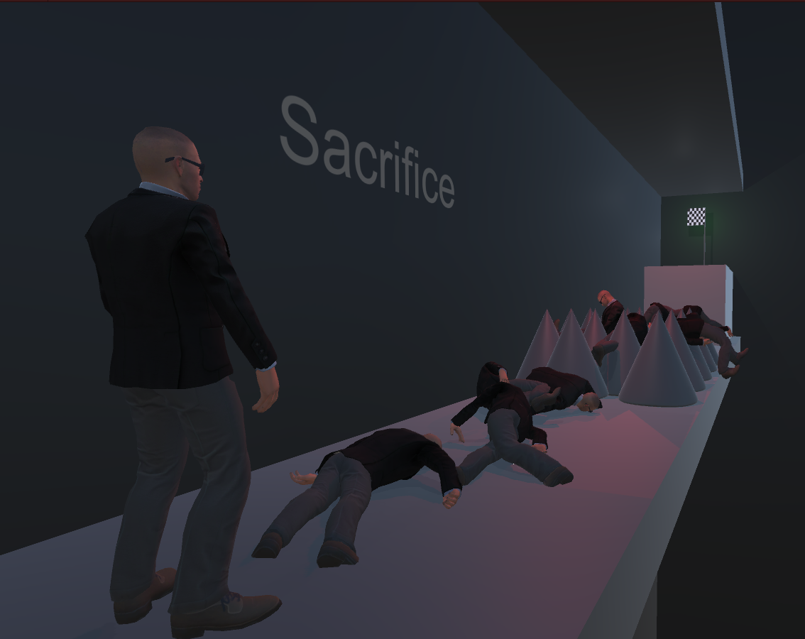

  

  Sometimes you must fail before you succeed.
   
   
  <a href="https://guibdbello.itch.io/sacrifice">Play Game</a>
  ·
  <a href="https://github.com/GuiBDBello/Sacrifice/issues/new?labels=bug&template=bug-report---.md">Report Bug</a>
  ·
  <a href="https://github.com/GuiBDBello/Sacrifice/issues/new?labels=enhancement&template=feature-request---.md">Request Feature</a>

## Table of Contents

<ol>
  <li><a href="#introduction">Introduction</a></li>
  <li><a href="#getting-started">Getting Started</a></li>
  <li><a href="#build-process">Build Process</a></li>
  <li><a href="#acknowledgments">Acknowledgments</a></li>
  <li><a href="#license">License</a></li>
</ol>

## Introduction

The game is meant to be about sacrifices to enable the next character to proceed. I.E.: If there are a path made with spikes, you may sacrifice your character and use it's body as a "platform" to walk above the spikes without touching them.

  

### How to Play

- **WASD**: Move.
- **Space**: Jump.
- **Left Mouse Button**: Throw grenade.

### Game Jam

This game was made for the game jam [Wowie Jam 3.0](https://itch.io/jam/wowie-jam-3), which took place between February 26th and March 1st of 2021.

Theme: **FAILURE IS PROGRESS**.

(<a href="#readme-top">back to top</a>)

## Getting Started

To get a local copy up and running follow the steps below.

### Prerequisites

1. [Unity](https://unity.com/download)

### Configuration

1. Clone repository: `git clone https://github.com/GuiBDBello/Sacrifice.git`.
1. Add the project to Unity or Unity Hub: `ADD > Select the folder you just cloned`.
1. Open project.

(<a href="#readme-top">back to top</a>)

## Build Process

1. With your project opened in Unity, select `File > Build Settings...`.
1. Select the `Platform` that you wish to build for (you may have to install a build module if you don't have it already installed).
1. Select `Build` or `Build And Run`.

(<a href="#readme-top">back to top</a>)

## Acknowledgments

List of references that were useful in the making of this project:

* [Unity Learn](https://learn.unity.com/)
* [Brackeys](https://www.youtube.com/channel/UCYbK_tjZ2OrIZFBvU6CCMiA)

### Assets

| Name | Type | Creator | Source |
| --- | --- | --- | --- |
| Bodyguards | 3D Model | [Batewar](https://assetstore.unity.com/publishers/11692) | [Unity Asset Store](https://assetstore.unity.com/packages/3d/characters/humanoids/humans/bodyguards-31711) |
| Breathing Idle, Jog Forward, Jumping | Animation | [Adobe](https://www.adobe.com/) | [Mixamo](https://www.mixamo.com/) |
| Dance of Creation | Audio | [Siddhartha Corsus](https://freemusicarchive.org/music/Siddhartha) | [Free Music Archive](https://freemusicarchive.org/music/Scott_Holmes) |
| Never Miss A Moment | Audio | [Scott Holmes](https://freemusicarchive.org/music/Scott_Holmes) | [Free Music Archive](https://freemusicarchive.org/music/Scott_Holmes/inspiring-background-music/never-miss-a-moment/) |
| Grenade sound effect | SFX | [MultiMax2121](https://freesound.org/people/MultiMax2121/) | [Free Sound](https://freesound.org/people/MultiMax2121/sounds/156896/) |
| Unity Particle Pack | VFX | [Unity Technologies](https://assetstore.unity.com/publishers/1) | [Unity Asset Store](https://assetstore.unity.com/packages/vfx/particles/particle-pack-127325) |

(<a href="#readme-top">back to top</a>)

## License

Distributed under the MIT License. See [LICENSE](./LICENSE) for more information.

(<a href="#readme-top">back to top</a>)

